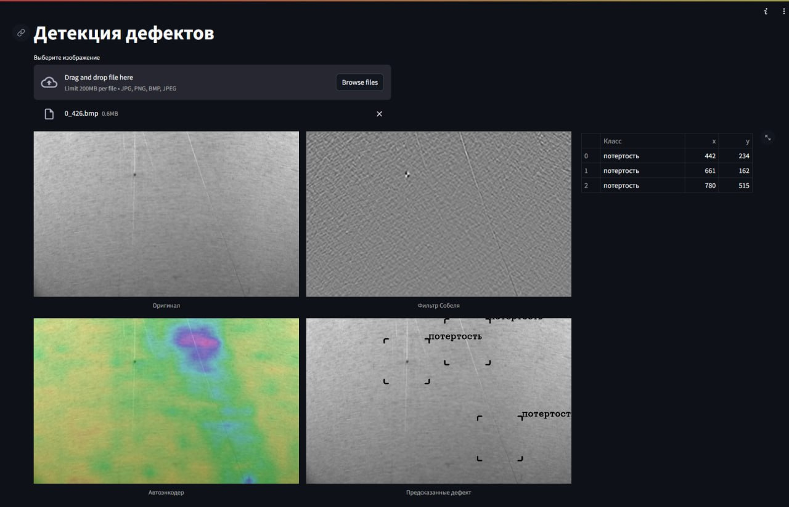

# Детекция дефектов

Для запуска обучения YOLO - ```python3 yolo.py```

Для запуска обучения автоэнкодера - ```python3 main.py```

Для запуска сервиса - ```streamlit run app.py```

Пример работы сервиса:

